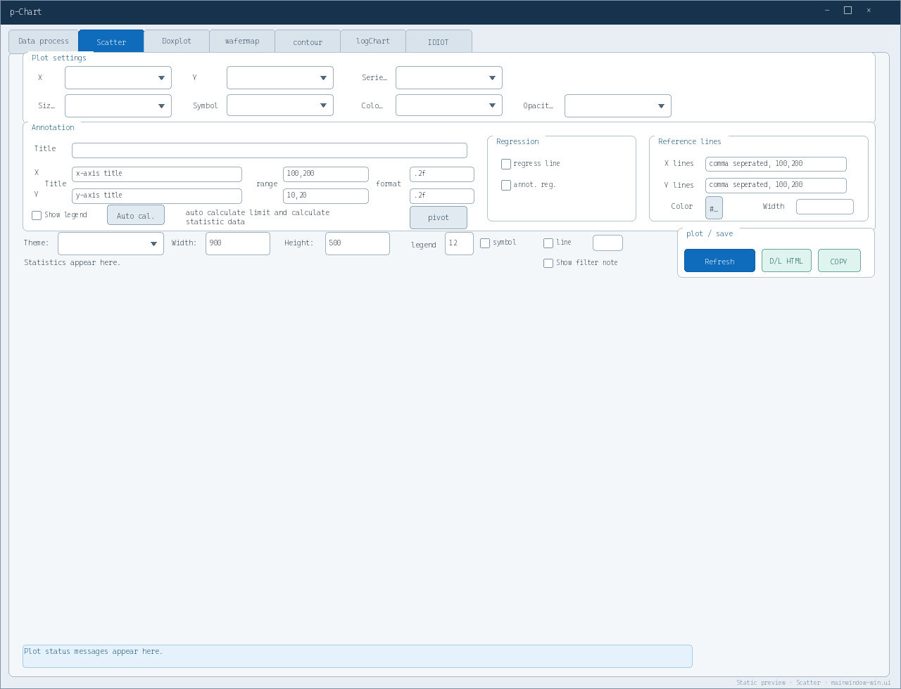

# p-chart

`p-chart` is a PySide6 desktop app for semiconductor data cleanup, reshape,
analysis, and Plotly visualization.

- Version: `v3.0` · `build 0713`
- Primary target: Windows 10, Python 3.13
- License: MIT



_Scatter-tab preview using the Windows layout and current professional palette._

## Features

| Tab | Main purpose |
| --- | --- |
| **Data process** | Load CSV/XLS/XLSX, clean data, run `pandas.wide_to_long`, and export CSV/Excel. |
| **Scatter** | Interactive scatter/line charts, grouping, reference lines, regression, statistics, and pivot summaries. |
| **Boxplot** | Grouped or separated box plots, subplot layouts, statistics annotations, reference lines, and pivots. |
| **Wafermap** | Wafer edge, frame/die layout, wafer-ID filtering, and KGD-style heatmaps. |
| **Contour** | Real or generated X/Y coordinates, 49/81-point templates, wafer grids, filled/line contours, and multiple interpolation methods. |
| **LogChart** | Compare CSV/TXT logs using overlay or subplot layouts with selectable X, Y1, and Y2 columns. |
| **IDIOT** | Paste and edit table data, add rows/columns or 49/81 coordinates, then transfer the result back to Data process. |

Charts redraw from live controls and can be exported as offline HTML. Plotly
figures also support PNG clipboard copy, with optional file saving. Qt WebEngine
is used when available; Remote Desktop and restricted environments can use the
system-browser fallback.

## Install and run

### macOS / development

```bash
python3 -m venv .venv
source .venv/bin/activate
python -m pip install -r requirements.txt -c constraints-macos-py313.txt
python app.py
```

### Windows PowerShell

```powershell
py -3.13 -m venv .venv
.\.venv\Scripts\Activate.ps1
python -m pip install -r requirements.txt
python app.py
```

Force the system-browser Plotly viewer when Qt WebEngine is unavailable:

```bash
python app.py --no-webengine
# short form
python app.py -W
```

## Typical workflow

1. Load or drop a CSV/Excel file in **Data process**.
2. Use the original table directly, or confirm the detected stubnames/suffix
   settings and run `wide_to_long`.
3. Select the required columns in a chart tab.
4. Refresh the chart, inspect statistics/pivots, then export HTML or copy PNG.

Use **Contour** for real X/Y contour mapping. The older Wafermap contour mode is
deprecated and now renders frame/die geometry only.

## Validate

```bash
source .venv/bin/activate
python scripts/release_check.py
python -m unittest discover -s tests -v
python scripts/gui_smoke.py --no-webengine
```

Optional 100,000-row performance check:

```bash
python scripts/performance_check.py
```

The complete release checklist is in
[`docs/release-smoke.md`](docs/release-smoke.md).

## Windows package

Build the Windows-oriented PyInstaller onedir package on Windows:

```powershell
.\.venv\Scripts\python.exe -m PyInstaller p-chart.spec
```

`p-chart.spec` bundles both Qt UI files, Plotly assets, the application fonts,
icons, coordinate templates, and required hidden imports. It is not configured
as a macOS `.app` bundle.

## Key files

- `app.py` — entry point, runtime options, platform UI selection, and app metadata.
- `mainwindow-win.ui`, `mainwindow-mac.ui` — Windows/macOS Qt Designer layouts.
- `tab*.py` — tab controllers for data, charts, wafer maps, logs, and table editing.
- `plot_export_helpers.py`, `plotly_local.py` — PNG and offline HTML export helpers.
- `wafermap_core.py`, `coord-49.csv`, `coord-81.csv` — wafer geometry and coordinates.
- `CascadiaCode.ttf`, `CascadiaNextTC.wght.ttf` — embedded UI and data fonts.
- `scripts/` and `tests/` — release, GUI, performance, and regression checks.
- `p-chart.spec` — Windows release packaging configuration.

## License

MIT. See [`LICENSE`](LICENSE).
